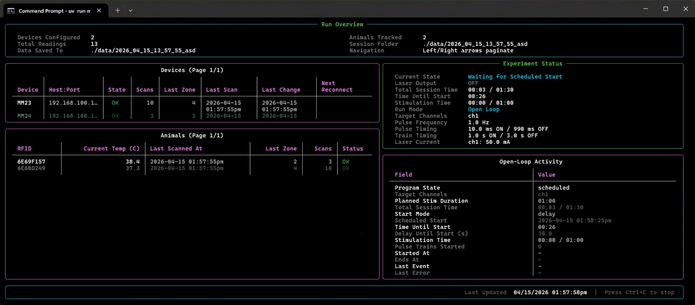
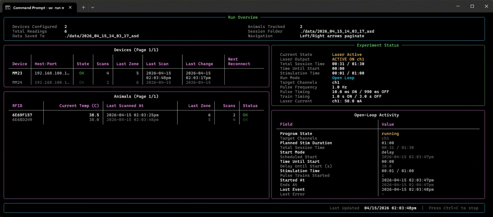

Open-loop behavior is easiest to understand if you separate three questions:

1. When does the run become allowed to start?
2. How long is the total run window?
3. Within that run window, what does each stimulation ON/OFF cycle look like?

Those map roughly to:

- `stimulus.start.*`
- `stimulus.run_for_minutes`
- `stimulus.train.*`
- `stimulus.pulse.*`

## Critical Rule

- the open-loop start schedule begins after launch confirmation

## Train Timing

If `train.off_seconds = 0`:

- stimulation starts once
- stimulation stays on for the run window

If `train.off_seconds > 0`, the runtime repeats:

1. start stimulation
2. stay ON for `train.on_seconds`
3. stop stimulation
4. stay OFF for `train.off_seconds`
5. repeat until the run window ends

## Worked Example

Suppose the config is:

- `run_for_minutes = 1`
- `train.on_seconds = 5`
- `train.off_seconds = 10`
- `pulse.period_ms = 1000`
- `pulse.time_on_ms = 10`

Operator interpretation:

- the total run window is 60 seconds
- each ON epoch lasts 5 seconds
- each OFF gap lasts 10 seconds
- inside each ON epoch, the fast pulse waveform is 1 Hz with 10 ms ON per pulse

Expected train timeline:

- `t=0s` to `t=5s`: ON
- `t=5s` to `t=15s`: OFF
- `t=15s` to `t=20s`: ON
- `t=20s` to `t=30s`: OFF
- `t=30s` to `t=35s`: ON
- `t=35s` to `t=45s`: OFF
- `t=45s` to `t=50s`: ON
- `t=50s` to `t=60s`: OFF

That produces four ON epochs during the 60 second run window.

## Runtime Examples

Waiting for the scheduled start:

Active stimulation:

