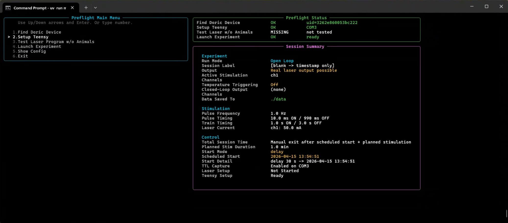
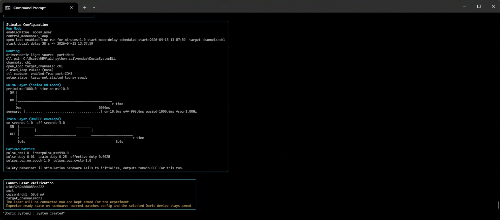
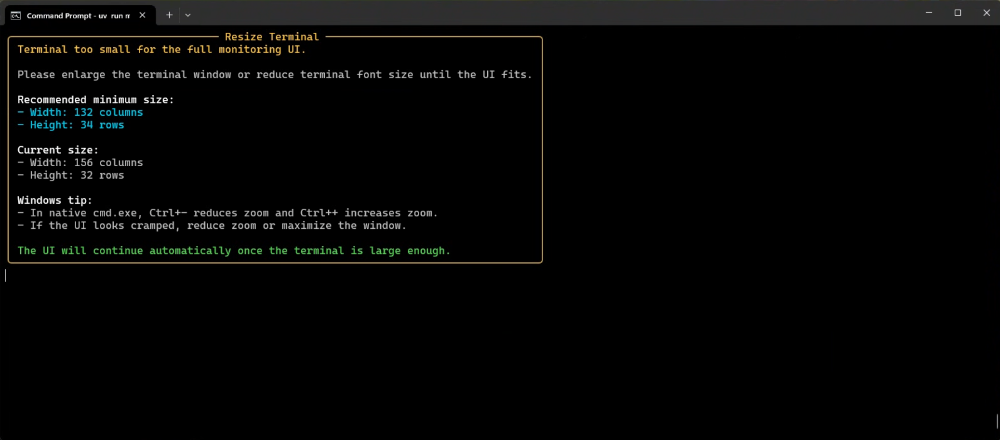

Preflight is the required operator workflow before a live run.

Its job is to answer four questions:

1. Are we talking to the right Doric device?
2. Is the Teensy TTL capture path ready if this run needs it?
3. Has the laser behavior been checked without animals when appropriate?
4. Does the operator understand when the run can actually begin?

## Preflight Sequence

The main menu is designed around this order:

1. Find Doric Device
2. Setup Teensy
3. Test Laser Program w/o Animals
4. Launch Experiment

## Find Doric Device

Use this step to confirm the software is targeting the correct Doric unit.

What to check:

- the selected UID or port matches the intended device
- the selected channels match the planned experiment
- the current values shown in preflight match the intended hardware settings

## Setup Teensy

If the run depends on TTL capture, this step must succeed before launch.

What to check:

- the correct serial device was selected
- handshake succeeded
- the displayed firmware/sample-rate details look plausible for the rig

## Launch Experiment

The rule to remember:

- the configured open-loop start schedule begins after you confirm launch

Examples:

- if the config says `delay_seconds: 30`, the 30 second countdown starts after launch confirmation
- if the config says `mode: clock`, the run is armed relative to the launch-confirmed session state, not merely because the app was opened earlier

## Resize Warning

If the terminal layout looks cramped or wraps badly, do not assume the UI is
still communicating clearly. Fix the terminal size first.

